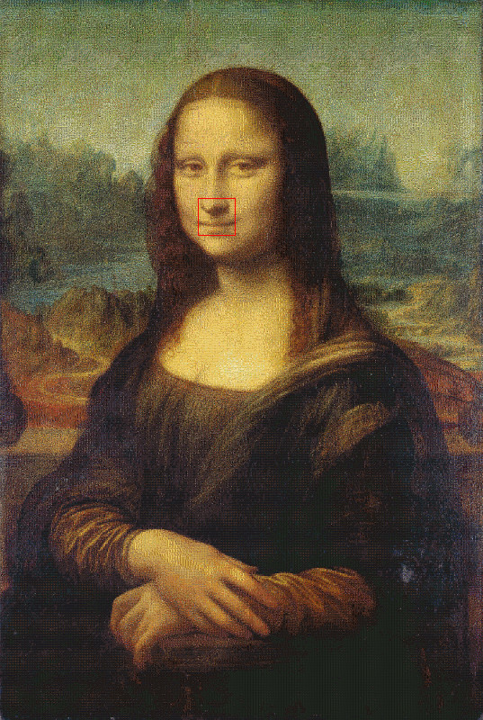
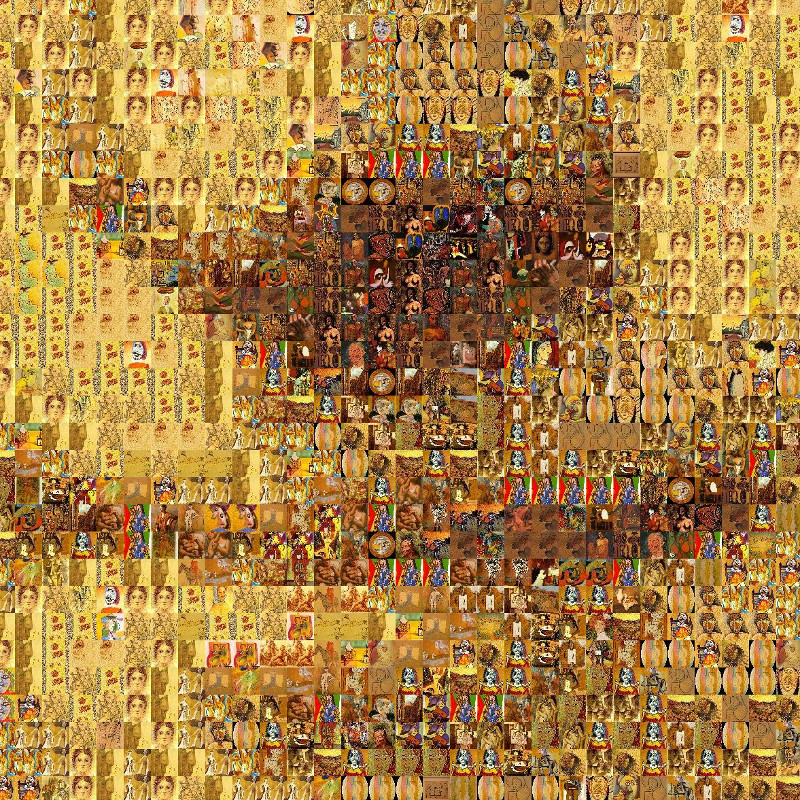

# photo-mosaic

During a boring weekend, I proposed the following programming challenge to
myself: _build Mona Lisa from Pablo Picasso's paintings._

And just so you know, I wasn't high. :)

## Results

Here goes a _thumbnail_ of the resulting image. Believe it or not, the
[original image](./img/demo-full.jpg.7z)'s resolution is
13960x20800 with over a hundred megabytes (113.7M to be more precise):



This is the highlighted section in more details:



This image was generated using a [corpus](http://torrentz.eu/164f8babe5bb2b6277656842ba2583334add7cc7)
of 3,588 images of Pablo Picasso's paintings and drawings.

The script took about 5 minutes to complete in my laptop equipped with a
quad-core (8 threads, 8M cache) Intel i7-920@2GHz processor and 8GB of RAM:

````bash
$ time lein run -w 40 -s <picasso-img-dir> -t ./tmp/ \
  -o ./tmp/output.jpg ./img/mona-lisa-original.jpg

real    4m31.411s
user    21m47.763s
sys     0m18.977s
````

As you can see, the code was optimized for parallel execution. If you know how
to make the code even more efficient, please let me know.

## How Does It Work?

The first step is to crop and scale down each image to be used to recreate the
desired picture. After that, we calculate the average color of each of those
images and store them in a [_k_-d tree](http://en.wikipedia.org/wiki/K-d_tree).

Then, for each pixel in the desired picture, we perform a nearest neighbor
search in the _k_-d tree in order to find the image with the closest average
color. The distance measure used is the
[squared distance](http://en.wikipedia.org/wiki/Euclidean_distance), which
provides a good balance between performance and correctness. (There are other
distance functions that model the
[human eye perception](http://en.wikipedia.org/wiki/Color_vision) more
accurately, but they are much more complex and expensive to compute).

## Usage

Run `lein run` to list all options available.

## Donate

If this project is useful for you, buy me a beer!

Bitcoin: `1CLFiuB5oghPjnq8zXFkYgKyFnCTVWEV1r`

## License

Copyright © 2014 Daniel Martins

Distributed under the 2-Clause BSD License. See LICENCE for further details.
