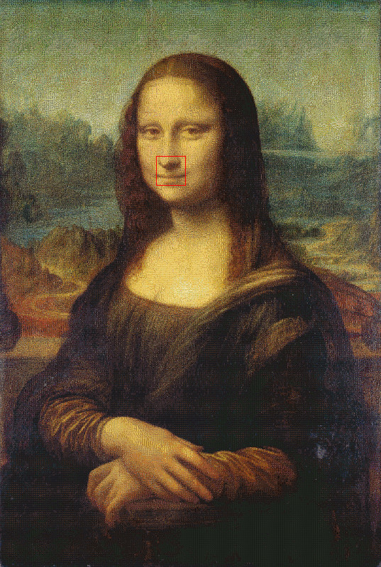
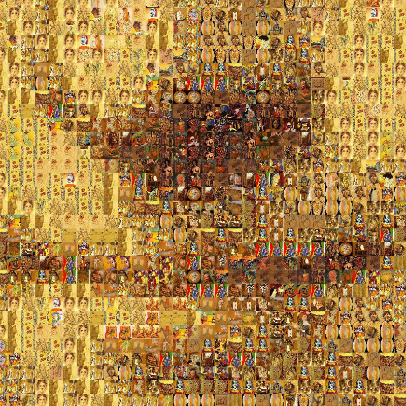

# photo-mosaic

Photographic mosaic experiment in Clojure.

## Motivation

Why not? :-)

During a boring weekend, I proposed a programming challenge to myself:
_how can I recreate Monalisa using only Pablo Picasso's paintings?_

## Results

Here goes a _thumbnail_ of the resulting image. Believe it or not, the
[original image](./resources/doc-img/demo-full.jpg.7z)'s resolution is
13960x20800 with over a hundred megabytes (113.7M to be more precise):



This is the highlighted section in more details:



This image was generated using a corpus with 3,588 images of Pablo Picasso's
paintings and drawings.

The script took about 5 minutes to complete in my machine, a quad-core (8
threads) Intel i7-920@2GHz with 8GB of RAM:

````bash
$ time lein run -w 40 -s ./resources/pics/ -t ./tmp/tiles/ -o ./tmp/out.jpg \
  ./resources/monalisa.jpg

real    5m28.115s
user    26m31.147s
sys     0m22.193s

````

As you can see, the code was optimized for parallel execution.

## How Does It Work?

The first step is to generated a scaled down and cropped version of each
image to be used to create the desired picture. After that, we calculate
the average color of each image and store them in a
[_k_-d tree](http://en.wikipedia.org/wiki/K-d_tree).

Then, for each pixel in the desired picture, we perform a nearest neighbor
search in the _k_-d tree in order to find the image with the closest average
color. The distance measure used is the
[squared distance](http://en.wikipedia.org/wiki/Euclidean_distance), which
provides a good balance between performance and correctness. (There are other
distance functions that model the
[human eye perception](http://en.wikipedia.org/wiki/Color_vision) more accurately,
but they are much more complex and expensive to compute).

## Usage

Run `lein run` to list all options available.

## License

Copyright © 2014 Daniel Martins

Distributed under the 2-Clause BSD License. See LICENCE for further details.
